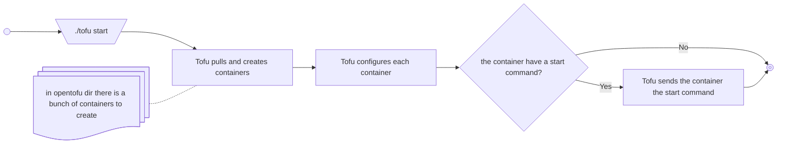

# MXL DEMO with OpenTofu

This is a mxl demo that is created by using OpenTofu to spin up and manage catena devices.



## First Time Start
1. Make sure Dashboard is closed or the mxl2ndi device is disconnected
2. Run these commands 1 at a time:
```
./ndi-builder.sh
./ts-builder.sh
./tofu build
./tofu init
./tofu start
```
3. open dashboard and connect to `localhost:7254` as a catena device

### Notes:
- `./tofu build` runs inside a container with Go and Make installed; Docker is required.
- `sudo chown -R 1000:1000 *` to fix some permison stuff
- No local Go/Make installation needed for builds.
- The provider binary `terraform-provider-catena_v0.1.0` is written to the repo root.
---

## Start normal
1. Make sure Dashboard is closed or the mxl2ndi device is disconnected
2. Run command:
```
./tofu start
```
3. open dashboard and connect to `localhost:7254` as a catena device

## Stop
1. Run command:
```
./tofu stop
```
2. close dashboard or disconect the mxl2ndi device

## Links for demo video sources
- https://www.vqeg.org/video-datasets-and-organizations/
- https://tsduck.io/streams/

## Known bugs
- Sometimes the selected Device Name and ID don't update
## TODOs
 - move project to github