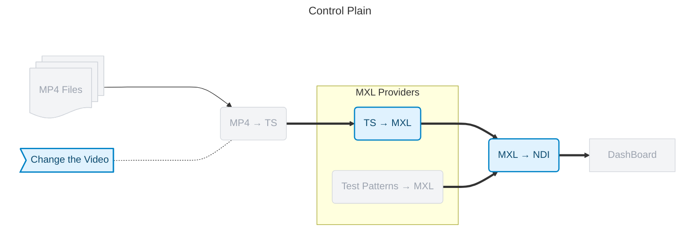

- **MP4 Files**: A collection of sample MP4 video files used as input for the demo.
- **MP4 → TS**: Converts MP4 files to MPEG-TS format.
- **Test Patterns → MXL**: Generates MXL streams from a test pattern.
- **TS → MXL**: Converts TS streams to MXL format.
- **MXL → NDI**: Converts MXL streams to NDI format for video production workflows.