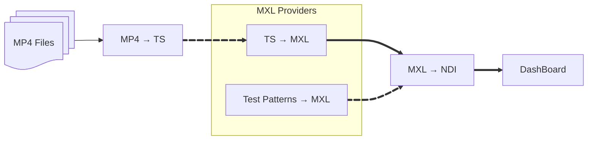

```mermaid
graph LR
  mp4Files@{ shape: docs, label: "MP4 Files" }
  mp42ts[<span class="led" id="led-mp42ts" title="MP4→TS status"></span>MP4 → TS]
  ts2mxl[<span class="led" id="led-ts2mxl" title="TS→MXL status"></span>TS → MXL]
  pat2mxl[<span class="led" id="led-pat2mxl" title="Test Patterns → MXL status"></span>Test Patterns → MXL]
  mxl2ndi[<span class="led" id="led-mxl2ndi" title="MXL→NDI status"></span>MXL → NDI]

  mp4Files --> mp42ts
  mp42ts e1@==> ts2mxl
  ts2mxl e2@==> mxl2ndi
  pat2mxl e3@==> mxl2ndi
  mxl2ndi e4@==> dashboard[DashBoard]

  click ts2mxl asdf "Toggle TS to MXL Stream"

  subgraph MXL Providers
    ts2mxl
    pat2mxl
  end
  e1@{ animate: true }
  e2@{ animate: false }
  e3@{ animate: true }
  e4@{ animate: false }

```
