# OpenTofu Resource Dependency Map

This document maps dependencies in `opentofu/*.tf`.

Legend:
- Solid arrow (`-->`): resource dependency (explicit `depends_on` or implicit reference to another resource)
- Dotted arrow (`-.->`): local/variable usage

```mermaid
flowchart TB

  %% -----------------------------
  %% Inputs: variables and locals
  %% -----------------------------
  subgraph VARS["Variables"]
    V_WORKSPACE["var.workspace_dir"]
  end

  subgraph LOC_MAIN["Locals (main.tf)"]
    L_CATENA_ENDPOINT["local.catena_endpoint"]
    L_NDI_PORTS["local.ndi_ports"]
    L_MXL_DOMAIN["local.MXL_DOMAIN"]
    L_CATENA_INPUTS["local.CATENA_INPUTS"]
    L_ECR_REG["local.ECR_REGISTRY"]
    L_MXL_TAG["local.MXL_TAG"]
    L_DIST_TAG["local.DISTCESSNA_TAG"]
    L_CHEETAH_TAG["local.CHEETAH_LITE_TAG"]
  end

  subgraph LOC_MXL2NDI["Locals (catena_mxl2ndi.tf)"]
    L_MXL_PARAMS["local.mxl_params"]
  end

  subgraph LOC_MV["Locals (multiviewer.tf)"]
    L_OUTPUTS["local.OUTPUTS"]
    L_INPUTS["local.INPUTS"]
    L_MULTIVIEWER["local.MULTIVIEWER"]
    L_CONTROL["local.CONTROL"]
    L_TOOLS_OUT["local.TOOLS_OUTPUTS"]
  end

  %% -----------------------------
  %% Resources
  %% -----------------------------
  subgraph IMAGES["docker_image Resources"]
    R_IMG_TS2MXL["docker_image.ts2mxl"]
    R_IMG_MXL2NDI["docker_image.mxl2ndi"]
    R_IMG_CONTROL["docker_image.control"]
    R_IMG_CHEETAH["docker_image.cheetah_lite"]
    R_IMG_MV["docker_image.multiviewer"]
    R_IMG_MXL_IN["docker_image.mxl_input"]
    R_IMG_MXL_OUT["docker_image.mxl_output"]
    R_IMG_MXL_TOOLS["docker_image.mxl_tools"]
    R_IMG_PROM["docker_image.prometheus"]
    R_IMG_GRAFANA["docker_image.grafana"]
  end

  R_NET["docker_network.multiviewer_network"]

  subgraph CONTAINERS["docker_container Resources"]
    R_TS2MXL["docker_container.ts2mxl_containers"]
    R_MXL2NDI_C["docker_container.mxl2ndicontainer"]
    R_IN["docker_container.input_containers"]
    R_OUT["docker_container.output_containers"]
    R_MV["docker_container.multiviewer"]
    R_CTRL["docker_container.control"]
    R_CHEETAH["docker_container.cheetah_lite"]
    R_TOOLS_OUT["docker_container.tools_outputs"]
    R_PROM["docker_container.prometheus"]
    R_GRAFANA_C["docker_container.grafana"]
  end

  subgraph CATENA["catena_device Resources"]
    R_CAT_TS2MXL["catena_device.ts2mxl"]
    R_CAT_MXL2NDI["catena_device.mxl2ndi"]
  end

  subgraph GRAFANA["grafana_* Resources"]
    R_GRAF_ORG["grafana_organization.org"]
    R_GRAF_DS["grafana_data_source.prometheus"]
    R_GRAF_FOLDER["grafana_folder.mv_folder"]
    R_GRAF_DASH["grafana_dashboard.mv_dashboard"]
  end

  %% -----------------------------
  %% Local composition
  %% -----------------------------
  L_OUTPUTS -.-> L_INPUTS
  L_OUTPUTS -.-> L_TOOLS_OUT
  L_CATENA_INPUTS -.-> L_INPUTS
  L_CATENA_INPUTS -.-> L_MXL_PARAMS
  L_MXL_DOMAIN -.-> L_MXL_PARAMS

  %% -----------------------------
  %% Local/variable usage by resources
  %% -----------------------------
  V_WORKSPACE -.-> R_TS2MXL
  V_WORKSPACE -.-> R_MXL2NDI_C
  V_WORKSPACE -.-> R_PROM

  L_CATENA_INPUTS -.-> R_TS2MXL
  L_CATENA_INPUTS -.-> R_CAT_TS2MXL
  L_CATENA_ENDPOINT -.-> R_CAT_TS2MXL
  L_MXL_DOMAIN -.-> R_TS2MXL
  L_MXL_DOMAIN -.-> R_CAT_TS2MXL

  L_NDI_PORTS -.-> R_MXL2NDI_C
  L_MXL_DOMAIN -.-> R_MXL2NDI_C

  L_MXL_PARAMS -.-> R_CAT_MXL2NDI
  L_CATENA_ENDPOINT -.-> R_CAT_MXL2NDI

  L_INPUTS -.-> R_IN
  L_INPUTS -.-> R_CTRL
  L_INPUTS -.-> R_CHEETAH
  L_INPUTS -.-> R_GRAF_DASH

  L_OUTPUTS -.-> R_OUT
  L_OUTPUTS -.-> R_CTRL
  L_OUTPUTS -.-> R_GRAF_DASH

  L_MULTIVIEWER -.-> R_MV
  L_MULTIVIEWER -.-> R_CTRL
  L_MULTIVIEWER -.-> R_GRAF_DASH

  L_CONTROL -.-> R_CTRL
  L_CONTROL -.-> R_TOOLS_OUT
  L_CONTROL -.-> R_GRAF_DASH

  L_TOOLS_OUT -.-> R_TOOLS_OUT
  L_MXL_DOMAIN -.-> R_IN
  L_MXL_DOMAIN -.-> R_OUT
  L_MXL_DOMAIN -.-> R_TOOLS_OUT

  L_ECR_REG -.-> R_IMG_CONTROL
  L_ECR_REG -.-> R_IMG_CHEETAH
  L_ECR_REG -.-> R_IMG_MV
  L_ECR_REG -.-> R_IMG_MXL_IN
  L_ECR_REG -.-> R_IMG_MXL_OUT
  L_ECR_REG -.-> R_IMG_MXL_TOOLS

  L_DIST_TAG -.-> R_IMG_CONTROL
  L_DIST_TAG -.-> R_IMG_MV
  L_CHEETAH_TAG -.-> R_IMG_CHEETAH
  L_MXL_TAG -.-> R_IMG_MXL_IN
  L_MXL_TAG -.-> R_IMG_MXL_OUT
  L_MXL_TAG -.-> R_IMG_MXL_TOOLS

  %% -----------------------------
  %% Resource dependencies
  %% -----------------------------
  R_IMG_TS2MXL --> R_TS2MXL
  R_IMG_MXL2NDI --> R_MXL2NDI_C
  R_IMG_MXL_IN --> R_IN
  R_IMG_MXL_OUT --> R_OUT
  R_IMG_MV --> R_MV
  R_IMG_CONTROL --> R_CTRL
  R_IMG_CHEETAH --> R_CHEETAH
  R_IMG_MXL_TOOLS --> R_TOOLS_OUT
  R_IMG_PROM --> R_PROM
  R_IMG_GRAFANA --> R_GRAFANA_C

  R_NET --> R_IN
  R_NET --> R_OUT
  R_NET --> R_MV
  R_NET --> R_CTRL
  R_NET --> R_CHEETAH
  R_NET --> R_TOOLS_OUT
  R_NET --> R_PROM
  R_NET --> R_GRAFANA_C

  R_TS2MXL --> R_CAT_TS2MXL

  R_IN --> R_CTRL
  R_CTRL --> R_CHEETAH
  R_OUT --> R_TOOLS_OUT

  R_CAT_TS2MXL --> R_CAT_MXL2NDI
  R_MV --> R_CAT_MXL2NDI
  R_MXL2NDI_C --> R_CAT_MXL2NDI

  R_GRAFANA_C --> R_GRAF_ORG
  R_GRAF_FOLDER --> R_GRAF_DASH
```

## Notes

- `grafana_data_source.prometheus` currently points to `http://prometheus:9090` by URL string; it does not directly reference `docker_container.prometheus`.
- `catena_device.mxl2ndi` has explicit `depends_on` for `catena_device.ts2mxl`, `docker_container.multiviewer`, and `docker_container.mxl2ndicontainer`.
- `docker_container.cheetah_lite` does not use explicit `depends_on`, but it references `docker_container.control.name` in `env`, creating an implicit dependency.
